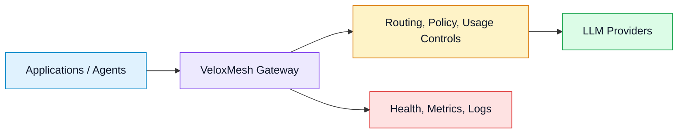
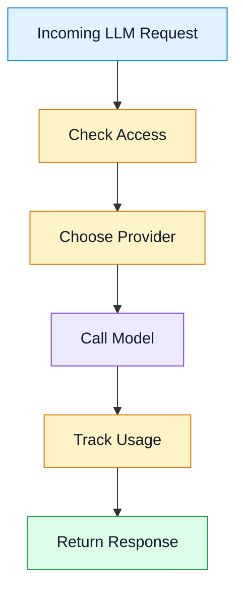

# VeloxMesh

VeloxMesh is a lightweight AI gateway for routing, governing, and observing LLM traffic across multiple providers. It gives teams one stable entry point for model access while keeping provider choice, fallback behavior, usage control, and operational visibility outside application code.

The goal is simple: make AI integrations easier to run, safer to change, and clearer to monitor.

## How It Fits





## Core Highlights

- **Unified LLM gateway**: expose OpenAI-compatible endpoints while routing requests to configured providers.
- **Multi-provider routing**: support explicit provider selection, default routing, and fallback across providers.
- **Operational controls**: manage API keys, quotas, rate limits, health checks, and runtime provider state.
- **Cost and usage awareness**: track request settlement and support budget-oriented admission checks.
- **Semantic cache ready**: integrate vector-backed caching paths for repeated or similar prompts.
- **Production-minded defaults**: health endpoints, metrics, structured logging, and durable control state.

## Main Features

VeloxMesh currently focuses on gateway and control-plane workflows:

- Chat completions proxy compatible with common LLM client patterns.
- Model listing through a gateway API.
- Provider configuration through environment/static config and durable control state.
- Health, readiness, and metrics endpoints for deployment checks.
- Redis-backed hot state for cache, rate limiting, config events, and fast runtime coordination.
- SQLite-backed durable state for local and single-node deployments.
- Optional Qdrant/Redis Stack vector support for semantic cache and fallback scenarios.

## Use Cases

VeloxMesh is useful when you want to:

- route one application across OpenAI-compatible, Anthropic, Gemini, or internal providers;
- test provider fallback without changing every client integration;
- centralize API key, quota, and usage policy enforcement;
- add observability around LLM traffic before scaling usage;
- run a local or single-node AI gateway with a path toward multi-instance deployment.

## Quick Start

### 1. Prerequisites

- Go 1.26.1 or compatible
- `make`
- At least one provider API key for live model calls

Optional services:

- Redis Stack for distributed hot state and Redis VSS fallback
- Qdrant for vector-backed semantic cache when explicitly configured

### 2. Configure Environment

Copy the local example environment file:

```bash
cp deploy/env/local.example.env .env
```

Set at least:

```env
DEV_API_KEY=vx-dev
OPENAI_PRIMARY_API_KEY=your-provider-key
```

For local development, the default gateway address is `:8080`.

For local development against PostgreSQL/pgvector, use the dedicated local example:

```bash
cp deploy/env/local.postgres.example.env .env
```

For Docker-based PostgreSQL, use the unified deployment profile:

```bash
sh deploy/scripts/veloxmesh-up.sh postgres
```

Replace all placeholder passwords, DSNs, encryption keys, and provider keys before running the gateway.

### 3. Run the Gateway

```bash
make run
```

### 4. Docker Deployment

Single-host Docker deployment is available under `deploy/`. Start with:

```bash
sh deploy/scripts/veloxmesh-up.sh simple
```

Edit the copied files before the second run. ONNX mode creates a default local scheduler artifact if `deploy/models/current/model.onnx` or `manifest.json` is missing. For Redis, Qdrant, PostgreSQL, Grafana, logs, and scheduler comparison profiles, see [deploy/README.md](deploy/README.md).

### 5. Check Health

```bash
curl http://localhost:8080/healthz
curl http://localhost:8080/readyz
```

### 6. List Models

```bash
curl http://localhost:8080/v1/models \
  -H "Authorization: Bearer vx-dev"
```

### 7. Send a Chat Request

```bash
curl -X POST http://localhost:8080/v1/chat/completions \
  -H "Authorization: Bearer vx-dev" \
  -H "Content-Type: application/json" \
  -d '{
    "model": "gpt-4o-mini",
    "messages": [
      { "role": "user", "content": "Hello from VeloxMesh" }
    ]
  }'
```

## Configuration Overview

VeloxMesh can start with simple environment variables and grow into durable runtime configuration.

Common settings:

| Setting | Purpose |
| --- | --- |
| `GATEWAY_DATA_ADDR` | Public gateway API address |
| `GATEWAY_ADMIN_ADDR` | Admin/control API address |
| `GATEWAY_METRICS_ADDR` | Metrics endpoint address |
| `DEV_API_KEY` | Local bearer token for development |
| `DEFAULT_PROVIDER` | Default provider ID |
| `OPENAI_PRIMARY_API_KEY` | Example provider key |
| `CONFIG_FILE` | Optional JSON provider/routing config |
| `CONTROL_STATE_BACKEND` | Durable control-state backend, such as SQLite |
| `REDIS_ENABLED` | Enable Redis-backed hot state |
| `REDIS_ADDR` | Redis server address |
| `QDRANT_ADDR` | Qdrant server address for vector features |
| `SCHEDULER_ENABLED` | Optional Scheduler scoring path; disabled by default |
| `SCHEDULER_QUEUE_BACKEND` | Scheduler queue backend; `auto`/empty defaults to memory, `redis` is explicit and node-scoped |
| `SCHEDULER_CONFIG_FILE` | Optional scheduler component config file |
| `CACHE_CONFIG_FILE` | Optional cache/vector component config file |
| `SEMANTIC_PIPELINE_CONFIG_FILE` | Optional input/output rule pipeline config file |

Keep secrets in environment variables or local secret stores. Do not commit real provider keys.

PostgreSQL settings live in `deploy/env/local.postgres.example.env` for local app runs and `deploy/env/postgres.example.env` for Docker Compose.

### Deployment Plans

| Plan | Components | Notes |
| --- | --- | --- |
| Plan 1 | App + SQLite + Redis Stack + Qdrant | Stable enhanced deployment. Redis remains for hot state, rate/config coordination, aggregation paths, and extension room. |
| Plan 3 | App + SQLite + LanceDB or Qdrant | Single-node only. LanceDB is the default when no vector store is configured; Qdrant is used only when explicitly configured. |

Scheduler queueing defaults to in-memory for Plan 1 and Plan 3. Set `SCHEDULER_QUEUE_BACKEND=redis` only when Redis is enabled and a node-scoped Redis queue is desired.

### PostgreSQL Migration And Smoke

Plan 4 migration uses external DSNs only:

```bash
go run ./cmd/controlstate-migrate \
  -sqlite "${SQLITE_DSN}" \
  -postgres "${POSTGRES_DSN}"
```

The migrator upserts supported control-state tables and stops on the first failed table or record. Its report lists completed tables, failed table, record key, root error, and repair guidance. It does not auto-rollback completed tables and does not skip failed records; fix the reported source record or target constraint, then rerun the same command.

Supported migration scope: provider configs, encrypted provider secrets, routing config, API keys, provider model rates, usage records, semantic cache records/metadata, fallback log state, limit rules, and session blacklist.

Run the gated Plan 4 smoke with operator-supplied values:

```bash
POSTGRES_TEST_DSN="${POSTGRES_DSN}" \
PLAN4_CONTROL_STATE_ENCRYPTION_KEY="${CONTROL_STATE_ENCRYPTION_KEY}" \
PLAN4_PROVIDER_API_KEY="${PROVIDER_API_KEY}" \
PLAN4_DEV_API_KEY="${DEV_API_KEY}" \
go test -timeout 60s ./tests/integration -run TestPlan4PostgresSmoke -count=1
```

Or use `scripts/smoke/plan4-postgres.sh`.

## Testing

Run the full Go test suite:

```bash
make test
```

Run formatting and vet checks:

```bash
make fmt
make vet
```

Some integration tests require local services such as Redis Stack or Qdrant. Set the related environment variables before running those tests.

## Scheduler Training

Offline scheduler model tooling lives under `tools/scheduler_training` and is run with `uv`. It exports safe completed samples, trains/evaluates the P70 output-token predictor, and publishes versioned runtime artifacts containing only `model.onnx` and `manifest.json`.

## Scheduler Rollout

Set `SCHEDULER_ONNX_ROLLOUT_PERCENT=0` to keep ONNX traffic off at startup. During runtime, authenticated admins can set `onnx_rollout_percent` to `0` with `PATCH /admin/scheduler/rollout` to roll ONNX traffic back to heuristic while leaving scheduler services running for diagnostics. The emergency FIFO bypass remains the existing `SCHEDULER_ENABLED=false` configuration.

For deployment, degradation, admin API, and Qdrant/pgvector semantic-neighbor guidance, see [Scheduler 1.0 Operator Runbook](docs/scheduler-1.0-runbook.md).

## Technology Snapshot

VeloxMesh is primarily built with:

- Go for the gateway and runtime services
- `chi` for HTTP routing
- SQLite for durable local control state
- Redis Stack for hot state, coordination, and selected vector fallback paths
- LanceDB as the embedded Plan 3 vector default when available
- Qdrant for explicitly configured vector-backed semantic cache workflows

These dependencies support the gateway experience; most users can start with the basic Go service and add Redis or vector storage only when their deployment needs it.
