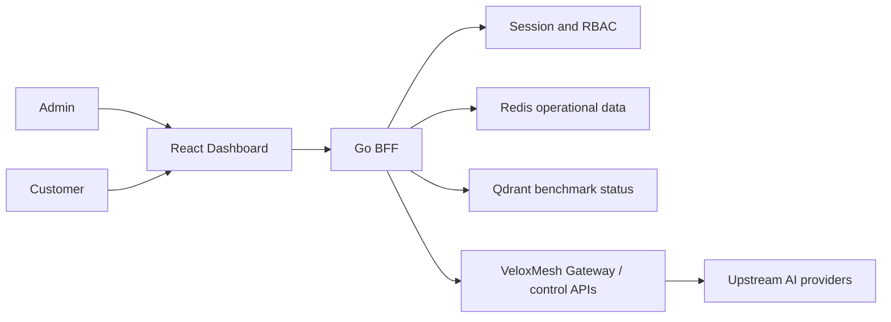

# VeloxMesh Dashboard

[English](#english) | [中文](#中文)

The VeloxMesh Dashboard is the web management and tenant portal for the [VeloxMesh AI Gateway](https://github.com/zardonc/VeloxMesh). It contains a React administration interface, a tenant-scoped Customer Dashboard, and a Go BFF that enforces authentication, authorization, and data isolation.

VeloxMesh Dashboard 是 VeloxMesh AI Gateway 的管理与客户门户，包含 React 控制面板、Customer Dashboard，以及负责认证、权限和租户隔离的 Go BFF。

## English

### What It Provides

**Admin Dashboard**

- Admin Home for gateway operational status
- Benchmark comparison and CSV/HTML report export
- Provider Health monitoring
- Requests / Logs inspection
- Role-protected Admin APIs
- Navigation placeholders for Routing, Tenants, Admin API Keys, Audit, and Settings

**Customer Dashboard**

- Customer registration, email-code verification, login, and logout
- Server-assigned Tenant identity
- Tenant-scoped usage summary and model distribution
- Request filtering by status, model, and time range
- Server-side pagination with page sizes 25, 50, and 100
- Customer API key creation, one-time secret display, masking, and revocation
- Loading, Empty, Error, No Permission, and Partial Data states

### Architecture



The browser calls only the BFF. The BFF derives the Customer Tenant from the authenticated session and does not trust a Tenant supplied through query parameters, headers, or request bodies.

### Repository Layout

```text
dashboard/
├── cmd/gateway/                 Go BFF entry point
├── internal/bff/                Authentication, RBAC, tenant APIs, Admin APIs
├── web/admin-console/
│   ├── src/                     React + TypeScript application
│   ├── e2e/                     Playwright acceptance tests
│   └── package.json             Frontend commands and dependencies
├── scripts/                     Local development and scenario scripts
├── tests/                       PowerShell scenario tests
├── docker/                      Local observability configuration
├── docs/                        Designs, runbooks, and acceptance evidence
├── docker-compose.yml           Local Redis/Qdrant/observability services
├── go.mod
└── README.md
```

### Prerequisites

- Go 1.26 or a compatible project toolchain
- Node.js 20+ and npm
- Docker Desktop or Docker Engine with Docker Compose
- Git
- An upstream OpenAI-compatible provider only when making live model calls

### Local Configuration

Create a local `.env2.local` in the `dashboard/` directory when Docker services or a live provider are required. This file is ignored by Git.

Common variable names:

```env
DEV_API_KEY=replace_me
DEFAULT_PROVIDER=provider_name
REDIS_ADDR=127.0.0.1:6379
QDRANT_URL=http://127.0.0.1:6333
QDRANT_API_KEY=replace_me
SANS_BASE_URL=https://provider.example/v1
SANS_PRIMARY_API_KEY=replace_me
SANS_PRIMARY_MODELS=model-a,model-b
SANS_PRIMARY_DEFAULT_MODEL=model-a
ADMIN_BOOTSTRAP_EMAIL=admin@example.test
ADMIN_BOOTSTRAP_USERNAME=local_admin
ADMIN_BOOTSTRAP_PASSWORD=replace_me
DASHBOARD_DEMO_MODE=false
```

Never commit `.env2.local` or a real provider key.

### Run Locally

Start the optional local data services:

```powershell
cd dashboard
docker compose --env-file .env2.local up -d
```

Start the Go BFF:

```powershell
cd dashboard
go mod download
go run ./cmd/gateway
```

Start the frontend in a second terminal:

```powershell
cd dashboard\web\admin-console
npm.cmd ci
npm.cmd run dev
```

Open:

```text
Dashboard:  http://127.0.0.1:5173
BFF health: http://127.0.0.1:8080/bff/health
```

The local `scripts/start-dev.ps1` helper is also available, but its Go and package-manager paths may need adjustment for a different Windows account.

### Verification

Run the Go tests:

```powershell
go test ./...
```

Run frontend unit tests and a production build:

```powershell
cd web\admin-console
npm.cmd test
npm.cmd run build
```

Run the complete browser acceptance suite:

```powershell
npm.cmd run test:e2e
```

The E2E command starts an isolated Redis container, BFF, and Vite server. It verifies Admin workflows, exports, Customer permissions, Customer A/B Tenant isolation, responsive layouts, page states, refresh behavior, logout, and persistence.

Current verified baseline:

- Go tests: passing
- Frontend unit tests: 38 passing
- Playwright acceptance tests: 4 passing
- Production build: passing

See [Customer Dashboard Final Acceptance Report](docs/customer-dashboard-acceptance-report.md) for the detailed evidence.

### Security

- Customer Tenant identity comes from the authenticated server session.
- Customer access to Admin APIs returns `403`.
- Unauthenticated Customer API access returns `401`.
- Cross-Tenant API key deletion returns `404`.
- API key secrets are displayed only once; stored lists return masked values.
- Environment files, generated reports, caches, and test artifacts are ignored by Git.
- Development verification codes must not be enabled in a production deployment.

### Current Limitations

- Routing, Tenants, Admin API Keys, Audit, and Settings are still frontend placeholders.
- Some Admin Home overview values require final integration with the production VeloxMesh control API.
- Browser CSV export currently contains aggregate BenchmarkRun rows, not the full request-level dataset.
- The acceptance suite uses small isolated data; full 20,000-row performance must be measured separately.
- Production SMTP and live provider behavior require deployment-environment validation.

---

## 中文

### 项目功能

**Admin Dashboard**

- 查看 Gateway 状态和 Benchmark 结果
- 查看 Provider Health 和 Requests / Logs
- 对比 Local Baseline、Gateway、Improved Model 和组合方法
- 导出 Benchmark CSV 和 HTML Report
- Admin API 权限保护
- Routing、Tenants、Admin API Keys、Audit、Settings 当前仍为占位页面

**Customer Dashboard**

- Customer 注册、邮箱验证码登录和退出
- 后端自动分配 Tenant
- 查看本 Tenant 的 Usage、Token、Latency 和模型分布
- 按状态、模型、起止时间筛选请求
- 25、50、100 条服务端分页
- 创建、掩码显示和撤销 Customer API Key
- 支持 Loading、Empty、Error、No Permission 和 Partial Data 状态

### 本地启动

启动 BFF：

```powershell
cd dashboard
go run ./cmd/gateway
```

启动前端：

```powershell
cd dashboard\web\admin-console
npm.cmd ci
npm.cmd run dev
```

访问：

```text
http://127.0.0.1:5173
```

### 完整测试

```powershell
cd dashboard
go test ./...

cd web\admin-console
npm.cmd test
npm.cmd run build
npm.cmd run test:e2e
```

### 安全要求

- 不上传 `.env2.local`
- 不上传真实 Provider API Key
- 不上传 `node_modules`、`dist`、`tmp`、`playwright-report` 和 `test-results`
- 正式环境关闭 Demo Mode
- 正式环境必须使用安全的验证码发送方式
- Customer 的 Tenant 必须始终由后端 Session 决定

### 项目关系

该目录是 VeloxMesh 主项目的 Dashboard 模块。主项目的部署模式、Gateway API 和模型 Provider 配置请参考 [VeloxMesh README](../README.md) 与 [deployment guide](../deploy/README.md).

