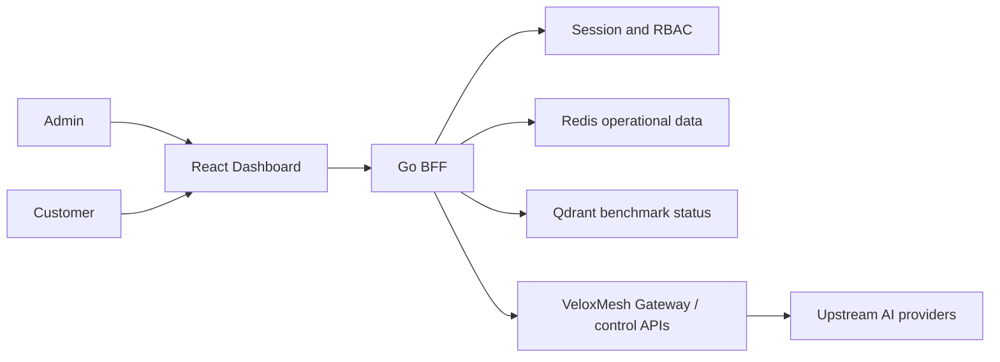

# VeloxMesh Dashboard

[English](#english) | [中文](#中文)

The VeloxMesh Dashboard is the web management and tenant portal for the [VeloxMesh AI Gateway](https://github.com/zardonc/VeloxMesh). It contains a React administration interface, a tenant-scoped Customer Dashboard, and a Go BFF that enforces authentication, authorization, and data isolation.

VeloxMesh Dashboard 是 VeloxMesh AI Gateway 的管理与客户门户，包含 React 控制面板、Customer Dashboard，以及负责认证、权限和租户隔离的 Go BFF。

## English

### What It Provides

**Admin Dashboard**

- Admin Home for gateway operational status
- Benchmark comparison with request-level CSV and complete ZIP report export
- Provider Health monitoring
- Requests / Logs inspection
- Role-protected Admin APIs
- System Management tabs for Routing, Tenants, Admin API Keys, Audit, and safe Settings
- Production Gateway configuration CRUD, masked one-time API key secrets, audit filtering, and audit CSV export

**Customer Dashboard**

- Customer registration, email-code verification, login, and logout
- Server-assigned Tenant identity
- Tenant-scoped usage summary and model distribution
- Request filtering by status, model, and time range
- Server-side pagination with page sizes 25, 50, and 100
- Customer API key creation, one-time secret display, masking, and revocation
- Loading, Empty, Error, No Permission, and Partial Data states

### Architecture



The browser calls only the BFF. The BFF derives the Customer Tenant from the authenticated session and does not trust a Tenant supplied through query parameters, headers, or request bodies.

### Repository Layout

```text
dashboard/
├── cmd/gateway/                 Go BFF entry point
├── internal/bff/                Authentication, RBAC, tenant APIs, Admin APIs
├── web/admin-console/
│   ├── src/                     React + TypeScript application
│   ├── e2e/                     Playwright acceptance tests
│   └── package.json             Frontend commands and dependencies
├── scripts/                     Local development and scenario scripts
├── tests/                       PowerShell scenario tests
├── docker/                      Local observability configuration
├── docs/                        Designs, runbooks, and acceptance evidence
├── docker-compose.yml           Local Redis/Qdrant/observability services
├── go.mod
└── README.md
```

### Prerequisites

- Go 1.26 or a compatible project toolchain
- Node.js 20+ and npm
- Docker Desktop or Docker Engine with Docker Compose
- Git
- An upstream OpenAI-compatible provider only when making live model calls

### Local Configuration

Create a local `.env2.local` in the `dashboard/` directory when Docker services or a live provider are required. This file is ignored by Git.

Common variable names:

```env
DEV_API_KEY=replace_me
DEFAULT_PROVIDER=provider_name
REDIS_ADDR=127.0.0.1:6379
QDRANT_URL=http://127.0.0.1:6333
QDRANT_API_KEY=replace_me
SANS_BASE_URL=https://provider.example/v1
SANS_PRIMARY_API_KEY=replace_me
SANS_PRIMARY_MODELS=model-a,model-b
SANS_PRIMARY_DEFAULT_MODEL=model-a
ADMIN_BOOTSTRAP_EMAIL=admin@example.test
ADMIN_BOOTSTRAP_USERNAME=local_admin
ADMIN_BOOTSTRAP_PASSWORD=replace_me
DASHBOARD_DEMO_MODE=false
DASHBOARD_TEST_MODE=false
SESSION_TTL=8h
SESSION_COOKIE_SECURE=true
VERIFICATION_SEND_EMAIL_LIMIT=3
VERIFICATION_SEND_IP_LIMIT=20
VERIFICATION_VERIFY_EMAIL_LIMIT=10
VERIFICATION_VERIFY_IP_LIMIT=50
VERIFICATION_RATE_WINDOW=15m
SMTP_HOST=smtp.example.com
SMTP_PORT=587
SMTP_USERNAME=veloxmesh-mailer
SMTP_PASSWORD_FILE=/run/secrets/veloxmesh_smtp_password
SMTP_FROM=noreply@example.com
SMTP_TLS_MODE=starttls
SMTP_SERVER_NAME=smtp.example.com
VELOXMESH_ADMIN_URL=http://127.0.0.1:8080
VELOXMESH_DATA_URL=http://127.0.0.1:8080
VELOXMESH_METRICS_URL=http://127.0.0.1:8080
VELOXMESH_ADMIN_API_KEY=replace_with_gateway_admin_key
VELOXMESH_DATA_API_KEY=replace_with_gateway_data_plane_key
VELOXMESH_API_TIMEOUT=10s
```

Never commit `.env2.local`, a real provider key, `VELOXMESH_ADMIN_API_KEY`, or `VELOXMESH_DATA_API_KEY`. The browser never receives these keys; only the Go BFF sends them to VeloxMesh. The data-plane key is used for the minimal live request that verifies a saved Provider or Routing configuration.

Production verification is fail-closed. Without a complete TLS SMTP configuration the registration/login verification flow returns `503` and does not return a code or write a local outbox. Codes are HMAC-SHA-256 protected, expire after five minutes, work once, and lock after five failures. Email, client IP, and challenge windows are rate limited. `SMTP_PASSWORD` is accepted only from the process environment; `SMTP_PASSWORD_FILE` has precedence and supports Docker/Kubernetes Secrets. See `docker-compose.smtp.example.yml` for the secret mount contract.

Production Session cookies are always `Secure`, `HttpOnly`, and `SameSite=Lax`; `SESSION_TTL` controls both the server expiry and browser cookie lifetime. Local HTTP tests must explicitly enable `DASHBOARD_TEST_MODE=true` or `DASHBOARD_DEMO_MODE=true`, which is the only mode allowed to return `devCode` or write `EMAIL_OUTBOX_PATH`.

`DASHBOARD_DEMO_MODE=true` explicitly enables the local Dashboard state used by tests and demonstrations. With `DASHBOARD_DEMO_MODE=false`, System Management reads and writes the real VeloxMesh Admin API and returns `503` when that integration is missing or invalid; it never silently falls back to `admin-state.json`.

### Run Locally

Start the optional local data services:

```powershell
cd dashboard
docker compose --env-file .env2.local up -d
```

Start the Go BFF:

```powershell
cd dashboard
go mod download
go run ./cmd/gateway
```

Start the frontend in a second terminal:

```powershell
cd dashboard\web\admin-console
npm.cmd ci
npm.cmd run dev
```

Open:

```text
Dashboard:  http://127.0.0.1:5173
BFF health: http://127.0.0.1:8080/bff/health
```

The local `scripts/start-dev.ps1` helper is also available, but its Go and package-manager paths may need adjustment for a different Windows account.

### Request-Level Benchmarks

Benchmark execution uses four stable method IDs:

| Method ID | Display name |
|---|---|
| `local_baseline` | Local Baseline |
| `gateway` | Our Gateway Method |
| `improved_model` | Improved Model |
| `gateway_improved_model` | Our Gateway + Improved Model |

The runner sends every model request through the Gateway `/v1/chat/completions` endpoint. It never calls an improved-model service directly from the Dashboard. Each attempt records its run ID, request ID, dataset row, method, provider, model version, route, timings, token counts, result state, retry count, and cache state. Prompts, response bodies, authorization headers, and API keys are not written to benchmark artifacts.

Run a small request-level benchmark from `dashboard/`:

```powershell
python scripts\benchmark\request_level_benchmark.py `
  --gateway-url http://127.0.0.1:18080 `
  --dataset-path C:\path\to\mmlu.jsonl `
  --dataset-name MMLU `
  --method-id gateway `
  --provider-id openai-primary `
  --model-id model-name `
  --model-version model-version `
  --run-id gateway-mmlu-001 `
  --output-dir reports\gateway-mmlu-001
```

Publish one or more completed report directories to the Dashboard Redis store:

```powershell
python scripts\benchmark\publish_request_level_results.py `
  --redis-addr 127.0.0.1:6379 `
  --report-dir reports\gateway-mmlu-001 `
  --report-dir reports\improved-model-mmlu-001
```

The publisher writes the recomputed aggregates to `veloxmesh:benchmarks` and canonical request rows to `veloxmesh:benchmark_requests`. Admin-only BFF endpoints expose `/bff/admin/benchmarks/raw.csv` and `/bff/admin/benchmarks/export.zip`. The ZIP contains `report.html`, `metadata.json`, `summary.csv`, `raw_requests.csv`, `errors_and_timeouts.csv`, and four SVG charts. Aggregate values are always recalculated from the raw request rows.

Register and verify an improved OpenAI-compatible model through the Gateway after the model owner supplies its redacted contract:

```powershell
$env:VELOXMESH_ADMIN_API_KEY = "runtime-admin-key"
$env:VELOXMESH_DATA_API_KEY = "runtime-data-key"
$env:IMPROVED_MODEL_API_KEY = "runtime-provider-key"

powershell -NoProfile -ExecutionPolicy Bypass `
  -File scripts\benchmark\register-improved-model.ps1 `
  -GatewayUrl http://127.0.0.1:18080 `
  -ProviderId improved-model `
  -BaseUrl https://model-service.example/v1 `
  -ModelId improved-model-id `
  -ModelVersion v1 `
  -TimeoutSeconds 30
```

The script verifies Gateway health, Provider registration, `/v1/models`, and a minimal chat request. Secrets are accepted only from runtime environment variables and are not printed or included in reports.

### Verification

Run the Go tests:

```powershell
go test ./...
```

Run frontend unit tests and a production build:

```powershell
cd web\admin-console
npm.cmd test
npm.cmd run build
```

Run the complete browser acceptance suite:

```powershell
npm.cmd run test:e2e
```

The E2E command starts an isolated Redis container, BFF, and Vite server. It verifies Admin workflows, exports, Customer permissions, Customer A/B Tenant isolation, responsive layouts, page states, refresh behavior, logout, and persistence.

Current verified baseline:

- Dashboard Go tests: passing
- Gateway control-state and HTTP management tests: passing
- Frontend unit tests: 49 passing
- Playwright acceptance tests: 7 passing
- Production build: passing

The root repository's complete `go test ./...` additionally requires `uv`, a real Qdrant address, `POSTGRES_TEST_DSN`, and the scheduler TCP test environment. Without those dependencies, the focused Step 4 packages pass but the external integration suites report environment failures.

See [Customer Dashboard Final Acceptance Report](docs/customer-dashboard-acceptance-report.md) for the detailed evidence.

### Security

- Customer Tenant identity comes from the authenticated server session.
- Customer access to Admin APIs returns `403`.
- Unauthenticated Customer API access returns `401`.
- Cross-Tenant API key deletion returns `404`.
- API key secrets are displayed only once; stored lists return masked values.
- Environment files, generated reports, caches, and test artifacts are ignored by Git.
- Development verification codes must not be enabled in a production deployment.
- SMTP requires TLS 1.2 or newer and verified server certificates; plaintext SMTP modes are rejected.
- Persisted API keys contain only a SHA-256 hash and static key prefix. The complete value is returned once by the create response.

### Current Limitations

- Routing is a single global Gateway configuration in production, so the Dashboard allows editing but disables adding or deleting additional routing rows.
- Provider creation against the real Gateway requires an upstream provider API key; the BFF forwards it only to VeloxMesh and does not store or return it.
- PostgreSQL management migrations compile and have contract coverage, but a live PostgreSQL integration run requires `POSTGRES_TEST_DSN`.
- `admin-state.json` remains available only for explicit DemoMode and for Dashboard authentication/session persistence; it is not the production Gateway configuration source.
- Some Admin Home overview values require final integration with the production VeloxMesh control API.
- A final real Improved Model comparison requires the model owner to provide its base URL, model ID, version, concurrency limit, timeout, and runtime credential.
- The acceptance suite uses small isolated data; full 20,000-row performance must be measured separately.
- Production SMTP and live provider behavior require deployment-environment validation.

---

## 中文

### 项目功能

**Admin Dashboard**

- 查看 Gateway 状态和 Benchmark 结果
- 查看 Provider Health 和 Requests / Logs
- 使用稳定 Method ID 对比 Local Baseline、Gateway、Improved Model 和组合方法
- 导出逐请求 Benchmark CSV 和完整 ZIP Report
- Admin API 权限保护
- System Management 已实现 Routing、Tenants、Admin API Keys、Audit、Settings 五个标签页
- 支持真实 Gateway 配置增删改查、管理员密钥一次性明文显示与掩码存储、审计筛选和 CSV 导出

**Customer Dashboard**

- Customer 注册、邮箱验证码登录和退出
- 后端自动分配 Tenant
- 查看本 Tenant 的 Usage、Token、Latency 和模型分布
- 按状态、模型、起止时间筛选请求
- 25、50、100 条服务端分页
- 创建、掩码显示和撤销 Customer API Key
- 支持 Loading、Empty、Error、No Permission 和 Partial Data 状态

### 本地启动

生产接入需要在 `.env2.local` 配置 `VELOXMESH_ADMIN_URL`、`VELOXMESH_DATA_URL`、`VELOXMESH_METRICS_URL`、`VELOXMESH_ADMIN_API_KEY`、`VELOXMESH_DATA_API_KEY` 和 `VELOXMESH_API_TIMEOUT`。只有显式设置 `DASHBOARD_DEMO_MODE=true` 时才使用本地演示配置。

正式环境验证码采用 HMAC-SHA-256 保护，5 分钟过期、一次有效、最多失败 5 次，并对邮箱、IP 和 Challenge 限流。未完整配置 TLS SMTP 时注册/登录验证码接口返回 `503`，不会返回验证码或写入本地 outbox。SMTP 密码只允许通过运行时 `SMTP_PASSWORD` 或 `SMTP_PASSWORD_FILE` Docker Secret 提供。

正式 Session Cookie 强制 `Secure`、`HttpOnly`、`SameSite=Lax`；`SESSION_TTL` 同时控制服务端与浏览器有效期。只有显式 Demo/Test Mode 才允许 `devCode` 和邮件 outbox。API Key 明文仅在创建成功时显示一次，持久化只保留 Hash 和静态 Prefix。

启动 BFF：

```powershell
cd dashboard
go run ./cmd/gateway
```

启动前端：

```powershell
cd dashboard\web\admin-console
npm.cmd ci
npm.cmd run dev
```

访问：

```text
http://127.0.0.1:5173
```

### 完整测试

```powershell
cd dashboard
go test ./...

cd web\admin-console
npm.cmd test
npm.cmd run build
npm.cmd run test:e2e
```

### 请求级 Benchmark 与改进模型

四种方法使用固定 ID：`local_baseline`、`gateway`、`improved_model`、`gateway_improved_model`。所有模型请求均由 Runner 调用 Gateway 的 `/v1/chat/completions`，Dashboard 不直接调用模型。

Runner 为每次请求保存 `run_id`、`request_id`、数据集行号、方法、Provider、模型与版本、路由、延迟、TTFT、Token、状态、HTTP 状态、错误类型、超时、重试和缓存命中。汇总结果由原始请求重新计算，并通过 Redis 的 `veloxmesh:benchmarks` 与 `veloxmesh:benchmark_requests` 两个键提供给 BFF。

Admin 可以从 `/bff/admin/benchmarks/raw.csv` 下载完整逐请求 CSV，从 `/bff/admin/benchmarks/export.zip` 下载完整报告包。ZIP 包含 HTML 报告、Metadata、Summary、原始请求、错误与超时样本及四张 SVG 图表；报告中不包含 Prompt、模型响应正文或任何 API Key。

真实改进模型接入前，模型同学必须提供脱敏后的 Base URL、Model ID、Model Version、并发限制和超时设置，密钥仅通过运行时环境变量传入。使用 `scripts\benchmark\register-improved-model.ps1` 通过 Gateway 注册并验证，不能把普通公共模型标记成 Improved Model。

### 安全要求

- 不上传 `.env2.local`
- 不上传真实 Provider API Key
- 不上传 `node_modules`、`dist`、`tmp`、`playwright-report` 和 `test-results`
- 正式环境关闭 Demo Mode
- `VELOXMESH_ADMIN_API_KEY` 只能保留在 BFF 服务端，不能写入 `VITE_*` 变量或浏览器响应
- 正式环境必须使用安全的验证码发送方式
- Customer 的 Tenant 必须始终由后端 Session 决定

### 项目关系

该目录是 VeloxMesh 主项目的 Dashboard 模块。主项目的部署模式、Gateway API 和模型 Provider 配置请参考 [VeloxMesh README](../README.md) 与 [deployment guide](../deploy/README.md).

### 当前限制

- 生产 Gateway 的 Routing 是单一全局配置，因此界面仅允许编辑，不允许新增或删除多条规则
- 真实 Provider 创建需要上游 Provider API Key；BFF 只转发给 VeloxMesh，不存储也不返回
- PostgreSQL 管理迁移已通过契约测试和编译；真实数据库验证仍需配置 `POSTGRES_TEST_DSN`
- `admin-state.json` 仅用于显式 DemoMode 和 Dashboard 登录会话，不再作为生产 Gateway 配置来源
- 真实 Improved Model 四方法对比仍需模型同学提供正式模型服务契约和运行时密钥
- 正式 SMTP 和两万条压力测试仍属于后续步骤
