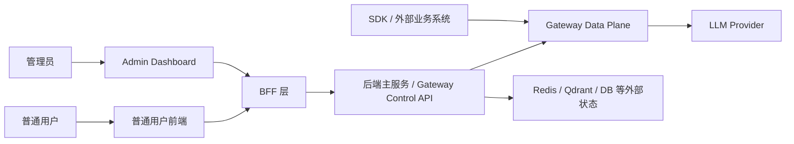
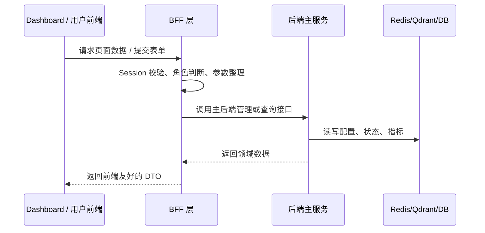
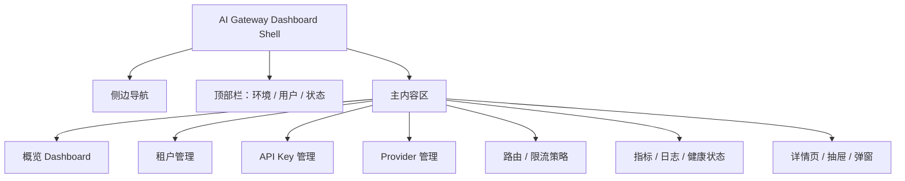
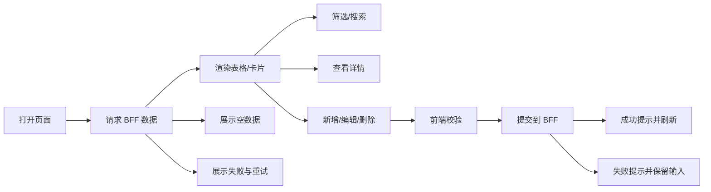

# AI Gateway Dashboard + BFF 层开发说明

本文用于帮助后续开发者快速进入 `AI Gateway Dashboard + BFF 层` 开发。重点是目标、结构、协作边界和测试方向，不展开底层实现细节。

## 1. 项目整体结构说明

开发落地时建议按以下逻辑拆分，具体目录以代码仓库实际结构为准：

```text
gateway/
  cmd/                                    # Go 服务入口
  internal/gateway/                       # 主后端服务：LLM 请求治理、路由、限流、观测
  internal/bff/                           # BFF：面向前端的聚合接口与会话边界
  internal/admin/                         # 管理能力：配置、租户、Provider、Key、策略等
  web/admin-console/                      # AI Gateway Dashboard 前端
  web/app/                                # 普通用户前端
  deployments/                            # docker compose、环境变量、部署配置
```

整体关系：



职责边界：

| 模块 | 主要职责 |
|---|---|
| `AI Gateway Dashboard` | 管理员使用的配置、监控、租户、Key、Provider、路由策略等管理页面 |
| 普通用户前端 | 普通用户使用的功能页面，避免暴露管理能力 |
| BFF 层 | 前端专用接口、会话校验、权限裁剪、数据聚合、读写路由 |
| 后端主服务 | Gateway 核心能力：请求治理、转发、限流、调度、观测、配置持久化 |

## 2. 本地开发环境启动说明

必要依赖：

| 依赖 | 用途 |
|---|---|
| Go 1.26.1+ | Gateway 与 BFF 层开发 |
| Node.js + pnpm/npm | 前端开发 |
| Docker / Docker Compose | 本地启动 Redis、Qdrant、DB 等依赖 |
| Redis | 热数据、限流、队列或缓存 |
| Qdrant | 语义缓存/向量检索相关能力 |
| DB | 配置、租户、Key、审计等持久化数据，按实际实现选型 |

推荐本地启动流程：

```bash
# 1. 启动基础依赖
docker compose up -d redis qdrant db

# 2. 启动 Gateway / BFF
go mod download
go run ./cmd/gateway

# 3. 启动前端
cd web/admin-console
pnpm install
pnpm dev
```

可用性验证：

```bash
# Gateway 健康检查
curl http://localhost:8080/health

# BFF 健康检查
curl http://localhost:8080/bff/health

# 前端开发服务
open http://localhost:5173
```

端口、命令和服务名以实际代码仓库为准。文档里只要求保留一条最短可跑通路径。

## 3. 前后端协作方式

前端只直接调用 BFF，不直接访问主后端内部接口。



协作原则：

| 事项 | 原则 |
|---|---|
| 接口联调 | 前端与 BFF 对齐请求/响应 DTO；BFF 与主后端对齐领域接口 |
| 数据流向 | 页面 -> BFF -> 主后端 -> 外部状态；不要让页面绕过 BFF |
| 权限边界 | 前端做显示控制，BFF 做可信权限裁剪，主后端做最终校验 |
| 错误处理 | BFF 统一转换错误码和错误文案，前端按状态展示 |
| 数据聚合 | 跨多个后端接口的数据由 BFF 聚合，页面避免拼装复杂领域数据 |

## 4. 前端模块划分

前端分为两类：

| 模块 | 面向用户 | 职责 |
|---|---|---|
| `AI Gateway Dashboard` | 管理员、运维、项目 owner | 管理租户、API Key、Provider、路由策略、限流、健康状态、指标和审计 |
| 普通用户前端 | 普通业务用户 | 使用 Gateway 暴露的普通功能，查看个人或团队相关数据，不提供系统级管理入口 |

建议两个前端共享基础 UI 组件、请求客户端和类型定义，但路由、权限、页面入口分开，避免普通用户误触管理能力。

## 5. 技术栈说明

前端暂定：

| 技术 | 用途 |
|---|---|
| React | 页面与组件开发 |
| Zustand | 轻量状态管理 |
| Tailwind CSS | 样式 |
| shadcn | 基础 UI 组件 |

BFF 层：

| 技术 | 用途 |
|---|---|
| Golang | 与主项目保持一致，复用类型、日志、配置和中间件 |
| HTTP JSON API | 前后端联调简单，便于调试 |
| Chi / net/http 风格路由 | 以主项目实际选择为准 |

## 6. AI Gateway Dashboard 页面开发方向

整体布局建议：



组件拆分建议：

| 层级 | 示例 |
|---|---|
| 页面级 | `DashboardPage`、`TenantsPage`、`ProvidersPage`、`RateLimitPage` |
| 业务组件 | `ProviderTable`、`TenantForm`、`KeyDetailDrawer`、`HealthBadge` |
| 通用组件 | `DataTable`、`EmptyState`、`ErrorState`、`ConfirmDialog` |
| 请求层 | `bffClient`、接口 DTO、错误码转换 |

数据展示方式：

| 场景 | 推荐展示 |
|---|---|
| 列表数据 | 表格，支持搜索、筛选、分页、排序 |
| 状态概览 | 卡片或紧凑指标块 |
| 单个对象详情 | 详情页、右侧抽屉或弹窗 |
| 配置编辑 | 表单 + 提交确认 |
| 操作结果 | Toast 或页面内状态提示 |

页面状态必须覆盖：

| 状态 | 前端表现 |
|---|---|
| 加载中 | Skeleton 或 loading indicator |
| 空数据 | 明确说明当前没有数据，并给出可执行入口 |
| 请求失败 | 展示错误原因和重试按钮 |
| 提交成功 | Toast 或成功状态，必要时刷新列表 |
| 权限不足 | 展示无权限状态，不暴露操作入口 |

典型交互流程：



## 7. 测试建议

前端页面测试：

| Case | 目标 |
|---|---|
| 页面首次加载成功 | 能渲染核心数据和主要操作入口 |
| loading / empty / error 状态 | 四类基础状态不出现空白页 |
| 表格筛选、分页、排序 | 查询参数正确传给 BFF |
| 表单校验 | 必填、格式、边界值能被拦截 |
| 提交成功 | 成功提示、数据刷新、弹窗关闭逻辑正确 |
| 提交失败 | 错误提示明确，用户输入不丢失 |
| 权限不足 | 不显示不可用操作，接口 403 有明确状态 |

BFF 接口测试：

| Case | 目标 |
|---|---|
| 健康检查 | `/bff/health` 可用 |
| Session 校验 | 未登录、过期、非法 token 被拒绝 |
| 角色权限 | 普通用户不能访问 admin 能力 |
| DTO 转换 | 后端领域数据能转换为前端需要的结构 |
| 错误转换 | 主后端错误能转换为稳定的 BFF 错误格式 |
| 超时/下游失败 | BFF 返回可处理错误，不挂死请求 |

联调测试：

| Case | 目标 |
|---|---|
| AI Gateway Dashboard -> BFF -> 主后端 | 核心页面能完成真实数据读写 |
| 普通用户前端隔离 | 普通用户不能调用 admin 接口 |
| 配置变更生效 | 管理端提交后，主服务读取到最新配置 |
| 异常状态 | Redis/Qdrant/DB 或主后端不可用时页面可降级 |
| 审计/日志 | 关键管理操作有 request id 和可追踪日志 |

后续等 BFF API 合约稳定后，再补具体字段、接口示例和页面级验收清单。
