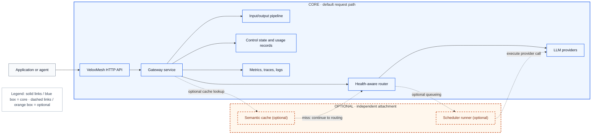
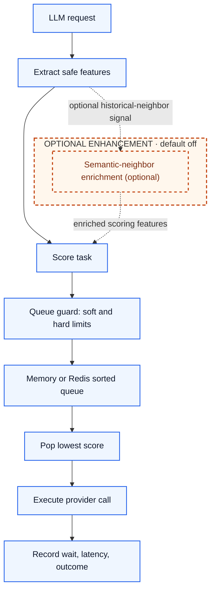
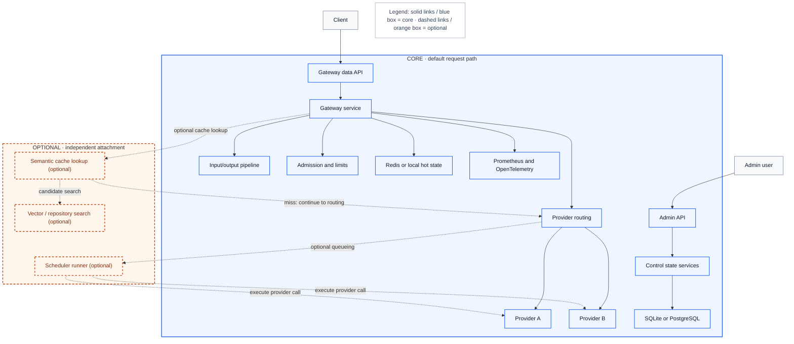
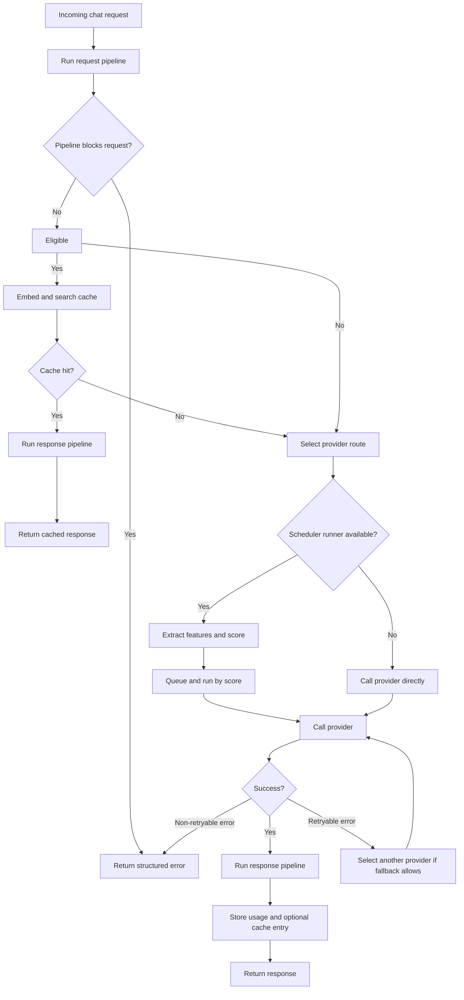

<!-- generated-by: gsd-doc-writer -->
# LLM Latency Optimization

This document explains how VeloxMesh reduces and controls latency for LLM traffic. It is written for readers who are not already familiar with the project, so it focuses on the main capabilities and design choices rather than low-level implementation details.

## Project Overview

VeloxMesh is a lightweight AI gateway for routing, governing, and observing LLM traffic across multiple providers. Applications send chat-completion requests to VeloxMesh instead of calling each provider directly. VeloxMesh then authenticates the request, applies policy, chooses a provider or combo route, calls the upstream model, records usage and latency, and returns an OpenAI-style response.

The project is designed for teams that want one stable entry point for model access while retaining control over routing, fallback, usage limits, provider health, semantic caching, and observability.

## Scheduler Module

The scheduler is an optional latency-aware scoring and queueing layer for gateway work. It does not replace provider routing; instead, it helps decide when queued requests should run and how much latency risk a request carries.

Its main responsibilities are:

- Extract safe scalar task features from the LLM request, such as model class, estimated input/output tokens, stream flag, request kind, tool-call presence, and priority.
- Score tasks using FIFO fallback, heuristic scoring, or predictive/ONNX scoring.
- Queue tasks by score and pop the lowest-score task first.
- Apply queue soft limits, hard limits, priority rules, and optional SLA promotion.
- Record queue wait, scheduler latency, prediction quality, and safe training samples when feedback is enabled.

The heuristic scorer estimates latency from request kind, token estimates, model class, priority, tool-call penalty, and streaming discount. Predictive scoring can use an external ONNX predictor to estimate output-token quantiles, then falls back to heuristic scoring when prediction is unavailable or unhealthy.

## Deployment and Architecture

VeloxMesh runs primarily as a Go gateway process started from `cmd/gateway/main.go` through `make run`. The scheduler also has a standalone service entry point in `cmd/scheduler/main.go`; it exposes a gRPC scoring API and an HTTP health/status/metrics surface.

The current repository ships Docker Compose files for supporting services, not a full gateway container deployment. The support services include Redis Stack, Qdrant, Prometheus, OpenTelemetry Collector, and a separate PostgreSQL/pgvector compose option.

Major runtime components are:

- Gateway HTTP API for chat completions, model listing, health, readiness, metrics, and admin routes.
- Provider adapters for OpenAI-compatible, Anthropic, and Gemini-style providers.
- Provider combos that expose virtual model names backed by multiple member models.
- Health-aware routing and provider circuit breaking.
- Admission control for credits, rate limits, and upstream account limits.
- Input/output pipeline for request filtering, prompt shaping, token-budget control, PII placeholdering, and response post-processing.
- Optional semantic cache backed by durable control state and a vector adapter.
- Optional scheduler runner with memory or Redis queueing.
- Control state backed by SQLite, PostgreSQL, or disabled static config.
- Redis-backed hot state for auth cache, rate limiting, health, config events, and coordination when enabled.

Architecturally, the latency-oriented design favors fast degradation. If Redis is unavailable, scheduler queueing can fall back to memory at startup. If scheduler scoring is disabled, busy, slow, timed out, or behind an open breaker, VeloxMesh falls back to FIFO or heuristic behavior instead of blocking the LLM call path.

## Concurrency Optimization

VeloxMesh handles regular HTTP concurrency through Go's HTTP server and then applies controls at the gateway, scheduler, provider, and state layers.

Key concurrency controls include:

- Admission control before provider calls, including API-key and upstream-account rate limits when durable state and hot state are configured.
- A provider circuit breaker that prevents repeated calls to providers that are currently failing.
- Scheduler executor slots through `executor_concurrency`, so scheduled work does not run without bounds.
- External scheduler scorer slots through `scorer_max_concurrency`, so scoring calls fail open to fallback when the scorer is busy.
- Queue soft limits and hard limits. Soft limits can briefly wait once; hard limits reject immediately.
- Optional Redis sorted-set queueing for node-scoped queued work when Redis is enabled and selected.
- Fusion combos run member provider calls in parallel, then use a judge model to synthesize the final answer.

The scheduler queue is priority-aware through its score. High-priority requests can bypass soft-limit backpressure, while normal and low-priority requests wait for the configured queue-pop timeout and then either proceed or receive a backpressure response.

## LLM Call Optimization

VeloxMesh uses several implemented mechanisms to reduce perceived latency, avoid slow paths, or improve throughput under load.

### Input and Output Pipeline

Before cache lookup, routing, scheduling, and provider calls, VeloxMesh runs a configurable semantic pipeline over the request. After a cache hit or successful provider response, it runs the response side of the same pipeline.

The pipeline is rule-based and disabled by default unless global or user-specific semantic rules enable it. Implemented request-side rules can reject a request before it reaches an upstream model, replace emails and phone numbers with placeholders, rewrite user text with configured prefixes/suffixes/replacements, truncate older conversation turns when a prompt-token limit is exceeded, and reserve response headroom by setting `max_tokens` from a context-window budget. Implemented response-side rules can block or replace an output and restore PII placeholders to their original values.

From a latency perspective, the most relevant rules are early filtering, prompt truncation, and response headroom. They can avoid unnecessary upstream calls, reduce oversized prompts, and keep generation budgets bounded before the scheduler or provider adapter sees the request.

### Health-Aware Routing

The router chooses among configured providers and can exclude providers that already failed during the current request. Provider health and model outcomes are updated after each call, and circuit breakers prevent repeated traffic to failing providers.

### Provider Combos

Provider combos let VeloxMesh expose a virtual model name backed by multiple member models. When a request targets a combo, the router uses the combo strategy instead of normal single-model routing.

The implemented combo strategies can help latency in different ways:

- `round-robin` spreads requests across combo members and then selects the least-latency healthy provider for the chosen member.
- `capacity-auto-switch` walks the member list looking first for a healthy provider that satisfies request capabilities such as streaming, tool use, or image input, then falls back to any healthy member.
- `fusion` runs member model calls in parallel and then sends successful member outputs to a judge model. This can avoid serial ensemble latency, but it adds a judge call and is not guaranteed to be faster than a single-provider route.

Combos are optional and only apply when configured in control state and requested through the combo's model name.

### Semantic Cache

For eligible non-streaming requests, VeloxMesh can perform semantic cache lookup before calling an upstream LLM. A cache hit returns a stored response directly from the gateway path. A cache miss continues to normal routing and, after a successful response, stores the response for future similar requests.

The semantic cache is optional and requires durable state, an embedding-capable provider, and a vector or repository-backed candidate search path. It is not used for streaming requests, admin identities, or explicit route overrides.

### Request Scheduling

When the scheduler runner wraps a provider call, the request is submitted as a task, scored, queued, and executed when it reaches the front of the queue. Response headers expose queue wait through `X-Queue-Wait-Ms`, making scheduler delay visible to clients.

### Batch Scoring and Prediction

The scheduler gRPC API accepts batches of task features. The predictive path also batches output-token prediction requests to its predictor service. This batching is for scoring and prediction metadata; VeloxMesh does not currently batch multiple user LLM requests into one upstream provider generation call.

### Timeouts and Slow-Path Fallback

Scheduler scoring has a short configurable timeout, with a default of `15ms`. Slow or failed scorer calls record breaker evidence and fall back quickly. The Python ONNX predictor client also uses timeout, max-concurrency, slow-threshold, and breaker controls.

Provider adapters use HTTP request contexts and configured HTTP clients to map provider timeouts, rate limits, unavailable providers, malformed responses, and other upstream failures into structured gateway errors.

### Provider Failover

When fallback is enabled and no explicit route override is used, retryable provider errors can trigger another provider selection that excludes providers already tried for the same request. This is provider failover, not an in-place retry loop with exponential backoff.

### Streaming

Streaming requests bypass semantic cache but still use routing, admission, scheduler wrapping, provider health updates, and response metadata. Stream handling records time to first token and total latency when stream events complete.

When response-side semantic rules are enabled for a streaming request, VeloxMesh buffers the stream before applying those rules. This preserves output filtering, replacement, and PII restoration semantics, but it means the client receives the processed result after buffering instead of receiving provider tokens immediately. For lowest time-to-first-token behavior, keep response-side rules disabled on latency-sensitive streaming routes.

## Latency Reduction Features

The implemented latency-oriented features are:

| Feature | Default state | How it helps |
| --- | --- | --- |
| Semantic cache | Optional, off by default (`cache.enabled=false`). | Avoids upstream LLM calls for similar eligible requests. |
| Input/output pipeline | Optional, all semantic rules off by default. | Blocks unwanted requests early, trims oversized prompts, reserves response headroom, and post-processes outputs. |
| Health-aware routing | Core path; routing defaults to `least-latency`. | Sends traffic away from unhealthy or unavailable providers. |
| Provider combos | Optional, only when combo records are configured and requested. | Spreads traffic, switches across capable healthy members, or runs parallel fusion flows. |
| Provider circuit breaker | Core path; enabled in the gateway service. | Prevents repeated slow/failing provider attempts while recovery is pending. |
| Provider failover | Optional, off in the example config (`fallback_enabled=false`). | Tries another eligible provider for retryable transient failures. |
| Scheduler scoring | Optional, off by default (`scheduler.enabled=false`). | Orders queued work using estimated latency, priority, and uncertainty. |
| Queue soft and hard limits | Optional, disabled by default (`0` limits). | Protects the gateway from unbounded queue growth and exposes backpressure quickly. |
| Executor concurrency cap | Scheduler path, default `executor_concurrency=1`. | Keeps scheduled execution bounded and predictable. |
| Scorer concurrency cap | External scorer path, default `scorer_max_concurrency=4`. | Prevents the scorer from becoming a blocking bottleneck. |
| Short scheduler timeout | Scheduler path, default `timeout=15ms`. | Keeps scoring as an optimization instead of a dependency that stalls requests. |
| Predictive/ONNX scoring | Optional, off by default (`mode=heuristic`, rollout `0`). | Uses learned output-token estimates when configured, with heuristic fallback. |
| Semantic-neighbor enrichment | Optional, off by default (`semantic_neighbors_enabled=false`). | Improves scoring with historical latency and outcome aggregates when enough similar samples exist. |
| Streaming support | Per request and provider capability; enabled when `stream=true`. | Returns incremental model output without waiting for a full completion. |
| Fusion parallelism | Optional combo strategy. | Runs combo member calls concurrently before judge synthesis; useful for ensemble flows, not guaranteed to minimize latency. |
| Metrics and tracing | Core observability path; tracing setup is best-effort. | Surfaces queue wait, scorer latency, provider latency, cache result, and stream timing for tuning. |

Together, these features make VeloxMesh latency-aware without making scheduler or cache infrastructure mandatory. The gateway remains usable in simple FIFO mode, then gains stronger latency control as teams enable semantic cache, scheduler scoring, predictive models, Redis, vector storage, and observability.
